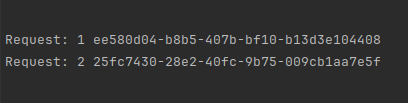
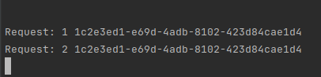

# Proof of Concept IoC Container

A simple IoC container for Go.
<hr>
This is a learning project that demonstrates the concept of Inversion of Control (IoC) containers in Go.

Usage is fairly simple.

Any `comparable` can be used as a key, booleans(although not recommended lol), numbers, strings, pointers, channels, arrays and structs.

```go
package main

import (
	"fmt"
	"github.com/gofiber/fiber/v2"
	"github.com/google/uuid"
	"ioc/di"
)

type PizzaService struct {
	Id uuid.UUID
}

func main() {
	i := 1
	app := fiber.New()

	di.Add("pizzaService", di.Singleton, func() *PizzaService {
		return &PizzaService{Id: uuid.New()}
	})

	/* Or could be done like this. Although empty structs are 0 bytes in size, I don't think this is a good idea lol.

	di.Add(PizzaService{}, di.Singleton, func()*PizzaService {
		return &PizzaService{Id: uuid.New()}
	})

	*/

	app.Get("/", func(c *fiber.Ctx) error {
		usrSrv := di.Resolve[*PizzaService]("usrSrv")

		// Again, this could be done like this if registered with the respective struct as the key:
		//usrSrv := di.Resolve[*PizzaService](PizzaService{})

		fmt.Println("Request:", i, usrSrv.Id)
		i++

		return nil
	})

	if err := app.Listen(":3000"); err != nil {
		panic(err)
	}

}
```

<hr>

### Transient



### Singleton



This is hardly a complete implementation of an IoC container.

I'm still not sure if _Dependency Injection_ is recommended in Go since it's claimed that Go should stay simple but this little project was a good start for me to learn the concept nonetheless.

Open to any suggestions and improvements.
